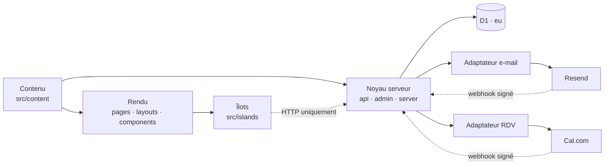
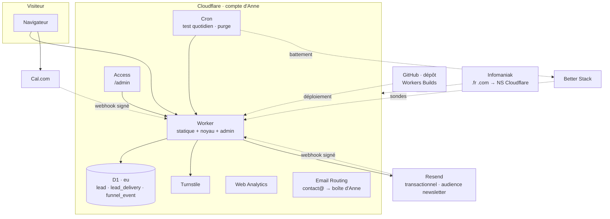

# Architecture Spine — Site Anne Vial-Tissot, vague 1

## Design Paradigm

**Islands sur site statique à contenu typé, avec un noyau serveur minimal.** Tout ce qui peut être connu au build est rendu en HTML statique depuis des objets de contenu validés par schéma ; le JavaScript client n'existe que dans des îlots déclarés ; un noyau serveur réduit porte ce qui exige une exécution à la demande — le gate du diagnostic, l'écriture des leads, la diffusion, l'administration, le cron. Le noyau obéit à une seule discipline : **écrire d'abord, diffuser ensuite**.

| Couche | Répertoire | Ce qui y vit | Ne dépend jamais de |
| --- | --- | --- | --- |
| Contenu | `src/content/` | Objets typés par langue, schémas, dictionnaires d'interface, données du diagnostic, identité | Tout le reste |
| Rendu | `src/pages/`, `src/layouts/`, `src/components/` | Pages statiques, gabarits, composants sans JS | Services à l'exécution (D1, Resend, Cal.com) |
| Îlots | `src/islands/` | Le seul JS client : scroll-craft, parcours du diagnostic, sélecteur de langue | D1, secrets |
| Noyau serveur | `src/pages/api/`, `src/pages/admin/`, `src/server/` | Gate, scoring, leads, diffusion, droits, webhooks, admin, cron, adaptateurs | Composants de rendu |
| Infra | `wrangler.jsonc`, `worker.ts`, `migrations/`, `RUNBOOK.md` | Déploiement, point d'entrée cron, schéma de base versionné, procédure de reprise | — |

## Invariants & Rules



Sens des dépendances : le contenu ne dépend de rien ; le rendu lit le contenu et **n'atteint jamais** D1 ni un service externe ; les îlots parlent au noyau par HTTP seulement ; le noyau est le seul à toucher la base et les services externes, chacun derrière un adaptateur unique. Les pages d'administration sont du noyau (rendu serveur), pas du rendu statique.

### AD-1 — Le contenu éditorial est un objet typé hors du code [ADOPTED]

- **Binds:** CAP-1, CAP-2, CAP-3, CAP-4, CAP-8, CAP-10, toutes les pages
- **Prevents:** du texte éditorial dans les gabarits ; deux pages qui rangent le contenu différemment ; un CMS futur qui impose une refonte ; des réponses de quiz illisibles quand un libellé change
- **Rule:** Tout texte, image ou donnée éditoriale vit dans `src/content/` sous l'un des types de l'inventaire, chacun avec un schéma déclaré **avant le premier objet** ; une propriété non déclarée fait échouer le build. Les gabarits ne contiennent aucune chaîne éditoriale — seulement des clés du dictionnaire d'interface. Le CMS de moyen terme se branche sur les schémas, jamais sur les pages. Inventaire fixé (relations et clés seulement ; autres champs en vague 2) : `StoryDeVente` (un bien vendu ; contient 0 à 2 `Temoignage` de `role` ∈ {`vendeur`, `acheteur`}, au moins un pour publier ; référence n `Media` dont une photo maîtresse) · `AvisImmodvisor` (instantané local : note, nombre, extraits attribués avec rôle vendeur/acheteur, URL de la fiche source ; un extrait peut référencer une `StoryDeVente`) — l'objet `TemoignageNonClient` est **retiré** (2026-09-13, D-8 : contenu non collectable) · `SequenceEmail` (un e-mail de la séquence de nurturing : `step` 1…n, `delay_days` depuis l'inscription, sujet et corps par langue ; contenu distillé du guide) · `Guide` (PDF ; clé `band` ∈ {`0-40`, `41-70`, `71-100`, `null`} — `null` = le guide générique accessible hors diagnostic) · `PageEditoriale` (à propos — Anne + méthode sur une page à ancres, avec un `Media` vidéo facultatif « méthode » qui n'est rendu que s'il existe —, vendre, acheter, légal) · `ContenuDiagnostic` (**identifiants immuables** : questions `q01`…`q17` et options `q01.a`… partagés par toutes les langues ; libellés et feedbacks par langue ; `bareme.json` et seuils indexés par ces identifiants) · `Identite` (nom, téléphone, adresse web, zone, RSAC, réseau — source unique, AD-13) · `Media` (identifiant stable, original non recadré, formats dérivés produits au build). Chaque objet porte un identifiant stable indépendant de la langue. Écart assumé au brief (qui proposait de fixer aussi tous les champs en vague 1) : décision de JB du 2026-09-07, option « règle + inventaire maintenant, champs en vague 2 avant le build ».

### AD-2 — Une langue livrée est complète ou n'existe pas [ADOPTED]

- **Binds:** CAP-10, toutes les pages, le diagnostic, les e-mails, le légal
- **Prevents:** un écran à moitié traduit ; une page anglaise au contenu français que Google traite en doublon ; un repli silencieux
- **Rule:** Une langue n'est publiée que si elle possède 100 % du dictionnaire d'interface, des `PageEditoriale`, du `ContenuDiagnostic` (17 écrans, 9 feedbacks), des gabarits d'e-mail et des pages légales ; **le build échoue** s'il manque une clé. Un objet éditorial = un identifiant stable + une entrée par langue (FR obligatoire, autres optionnelles, chacune avec son titre et son slug). Un objet optionnel (story, témoignage) absent dans une langue **n'est pas publié** dans cette langue — ni index, ni sitemap, ni `hreflang` ; le sélecteur renvoie vers l'index de l'autre langue. Le repli vers le français n'existe nulle part ailleurs — écart assumé au SPEC (CAP-10 « repli systématique »), décision de JB du 2026-09-07. Langues livrées en v1 : `fr`, `en`.

### AD-3 — Une URL par langue, jamais de détection automatique [ADOPTED]

- **Binds:** CAP-10, SEO, toutes les pages
- **Prevents:** des redirections par pays qui perdent des visiteurs ; des `hreflang` vers des pages inexistantes ; deux canoniques pour une page ; une URL de story qui change après publication
- **Rule:** Le français est servi sans préfixe (`/ventes`), les autres langues avec préfixe (`/en/sales`). Aucune redirection selon le pays ou le navigateur — au plus une suggestion. `hreflang`, sitemap et canonique sont **générés depuis le contenu réel** (une entrée n'est déclarée que si elle existe dans la langue) ; les générateurs standard sont remplacés dès qu'ils déclarent une traduction manquante. Un slug publié ne change plus ; s'il doit changer, l'ancien redirige en 301. Les surfaces du noyau (résultats, admin) existent dans chaque langue livrée, hors admin (FR seul).

### AD-4 — Écrire d'abord, diffuser ensuite, une seule fois [ADOPTED]

- **Binds:** CAP-5, CAP-6, CAP-7, CAP-8, CAP-9, admin, cron
- **Prevents:** une notification sans stockage ; un lead perdu quand un service aval tombe ; un doublon au renvoi ; deux modules qui écrivent le même marqueur de diffusion
- **Rule:** Toute capture — gate du diagnostic, contact direct, guide, réservation (webhook Cal.com) — exécute **en première opération** l'écriture du lead dans D1 et ne répond au visiteur qu'après. Chaque soumission porte une **clé d'idempotence** (`submission_id`, ULID généré par l'îlot ; pour `rdv`, l'`uid` de la réservation Cal.com) sous index unique : un renvoi retourne le résultat de la première écriture, jamais un second lead. Si l'écriture D1 échoue, le visiteur reçoit une erreur neutre, l'îlot conserve les réponses et propose le renvoi ; un échec systémique est détecté par AD-12. Les diffusions aval (notification à Anne, confirmation au prospect, inscription newsletter, Modelo) sont des lignes de `lead_delivery` créées par l'écriture du lead et exécutées par **un seul module** (`server/delivery`), rejouables depuis l'admin ; les adaptateurs (AD-8) sont sans état et n'écrivent jamais en base. Un échec aval n'est jamais une erreur pour le visiteur. Aucun autre lieu de stockage des leads n'existe.

### AD-5 — Le gate est serveur : les résultats n'existent pas dans le navigateur avant soumission [ADOPTED]

- **Binds:** CAP-4, CAP-5, CAP-7
- **Prevents:** des résultats lisibles dans la page avant le formulaire (le ScoreApp actuel) ; une page de résultats atteignable par URL ; un score calculé côté client ; un état de parcours détruit par un changement de langue
- **Rule:** Le parcours (17 écrans) tourne dans un îlot dont l'état est **indépendant de la langue** : réponses en mémoire sous forme `{ q01: ["q01.a"], … }` par identifiants AD-1, plus `journey_id` (AD-11) ; changer de langue à mi-parcours conserve l'état. À la soumission, le noyau reçoit réponses par identifiants + coordonnées + `lang` = langue de la page de soumission, **valide** (AD-7), **calcule** scores, bande et orientation A/B (règles CAP-7 : Q14 choisit l'offre ; Q12 « minimiser les frais » force B) depuis `bareme.json`, écrit (AD-4) et **rend** la page de résultats liée à un `token` opaque, à usage unique par navigateur, expirant à 24 h ; hors de cette fenêtre, ou sans scores associés, la route répond 404. Le barème n'est lu que par le noyau.

### AD-6 — Forme du lead : une table, un contrat par source [ADOPTED]

- **Binds:** CAP-5, CAP-6, CAP-7, CAP-8, CAP-9, CAP-11, admin, e-mails, purge, droits
- **Prevents:** cinq formulaires qui définissent cinq leads ; un consentement non prouvable ; un lead sans langue ; un champ obligatoire que la source ne peut pas fournir ; un jeton unique qui bloque un deuxième contact
- **Rule:** Une seule table `lead`, une ligne par capture ; colonnes communes : `id` (ULID), `submission_id` (unique), `created_at`, `last_activity_at`, `lang`, `source` ∈ {`diagnostic`, `contact`, `guide`, `rdv`, `estimation`}, `email`, `privacy_accepted_at`, `newsletter_opt_in_at` (nullable, opt-in distinct), `newsletter_unsubscribed_at` (nullable), `utm` (JSON nullable), `is_test`. Contrat par source :

| Champ | `diagnostic` | `contact` | `guide` | `rdv` | `estimation` |
| --- | --- | --- | --- | --- | --- |
| `prenom`, `nom` | obligatoires | obligatoires | obligatoires | `nom` = nom complet Cal.com, `prenom` null | obligatoires |
| `telephone` (E.164) | obligatoire | obligatoire | facultatif | si fourni par Cal.com | obligatoire |
| `privacy_accepted_at` | case cochée | case cochée | case cochée | question obligatoire du formulaire Cal.com, horodatée à la réservation | case cochée |
| `token`, `answers` (JSON par identifiants), `scores` (global + 3 catégories, brut et %), `band`, `orientation` ∈ {`A`, `B`}, `message` (≤ 1 000 car.) | obligatoires (`message` facultatif) | null (`message` obligatoire) | null | null | null (`message` facultatif) |
| `projet` ∈ {`vente`, `achat`} | null | obligatoire | null | null | null |
| `commune_bien`, `type_bien` | null | null | null | null | obligatoires |

Source `estimation` (CAP-11, D-4, 2026-09-13) : le site ne produit aucune estimation ; le lead déclenche `notify_anne` et `confirm_prospect` comme le contact. `projet` sur le contact qualifie le parcours vendeur / acheteur (D-5) sans créer de source.

Index unique **partiel** sur `token` (`source = 'diagnostic'`). `lead_delivery` (`lead_id`, `channel` ∈ {`notify_anne`, `confirm_prospect`, `sequence:<step>`, `modelo`}, `due_at`, `status`, `attempts`, `delivered_at`, `last_error`) — les lignes `sequence:<step>` sont créées à l'opt-in avec `due_at` = inscription + `delay_days`, et exécutées par le cron quotidien remplace tout marqueur dans `lead` ; `funnel_event` (`journey_id`, `event`, `screen`, `lang`, `is_test`, `at`) ne contient aucune donnée personnelle et ne référence jamais `lead`. Écart assumé au SPEC (CAP-8 « mêmes coordonnées que CAP-5 ») : téléphone facultatif pour le guide, décision de JB du 2026-09-07.

### AD-7 — Rien n'entre dans la base sans vérification serveur ; deux origines, deux contrôles [ADOPTED]

- **Binds:** CAP-5, CAP-6, CAP-8, CAP-9, webhooks
- **Prevents:** une protection contournable en désactivant le JS ; des leads fantômes ; une route de webhook publique qui écrit en base ; une limite imposée seulement par le composant client
- **Rule:** *Origine visiteur* (diagnostic, contact, guide, estimation) : dans cet ordre, avant AD-4 — jeton Turnstile (mode invisible) validé côté serveur, champ piège vide, limite de fréquence par adresse, puis validation contre un schéma serveur (formats d'AD-6, réponses conformes aux identifiants du `ContenuDiagnostic`, longueurs). *Origine service* (Cal.com, Resend) : signature du webhook vérifiée avec le secret partagé, rejet sinon ; idempotence par identifiant de l'événement. Un échec renvoie une erreur neutre ; rien n'est écrit.

### AD-8 — Un fournisseur par fonction, derrière un adaptateur unique ; e-mail délivrable ; fichiers non publics [ADOPTED]

- **Binds:** noyau, cron, admin, CAP-7, CAP-8, CAP-9, séquence de nurturing
- **Prevents:** un appel Resend ou Cal.com dispersé ; un changement de fournisseur qui devient une refonte ; une clé API dans Git ; un e-mail d'Anne classé en spam ; un PDF « réservé » accessible par URL
- **Rule:** Chaque service externe (e-mail et newsletter : Resend · RDV : Cal.com · surveillance : Better Stack) est atteint par **un seul module** dans `src/server/adapters/`, sans état, exposant une interface propre au site. Le RDV délègue à Cal.com ce qu'il fait nativement — disponibilités réelles, fuseau du visiteur, verrouillage du créneau, confirmations aux deux parties — ; le noyau n'envoie pas de seconde confirmation. E-mail : envoi depuis `annevialtissot.fr` avec SPF, DKIM et DMARC (`p=quarantine`) dans le DNS Cloudflare, expéditeur `anne@annevialtissot.fr`, `Reply-To` la boîte d'Anne ; la séquence de nurturing (sortie B de CAP-7) est **envoyée par le site lui-même** : objets `SequenceEmail` (AD-1), lignes `lead_delivery` datées, cron quotidien, envoi transactionnel Resend ; le lien de désabonnement pointe sur une route du noyau (jeton signé) qui écrit `newsletter_unsubscribed_at` et annule les envois restants — aucune audience ni broadcast Resend, aucun contenu rédigé hors du dépôt. Le PDF du guide **n'est jamais un fichier statique public** : servi par le noyau via un lien signé, lié au lead, expirant à 7 jours, affiché après capture et envoyé par e-mail. Secrets = *secrets* Cloudflare Workers ; `wrangler.jsonc` ne contient que des identifiants publics. Aucune donnée personnelle ne quitte D1 vers un service absent de la politique de confidentialité.

### AD-9 — Anne est titulaire de chaque compte, JB membre, MFA partout [ADOPTED]

- **Binds:** tous les comptes de la chaîne de production
- **Prevents:** un site qui dépend d'un compte personnel de JB ; une carte bancaire ou un e-mail de récupération au mauvais nom ; un compte admin sans second facteur
- **Rule:** Infomaniak, Cloudflare (super-admin + facturation), Resend, Cal.com, Google Business Profile, Better Stack : titulaire Anne, JB invité avec les droits d'administration ; MFA activé sur les deux identités Cloudflare et codes de récupération dans le coffre. Exception temporaire : le dépôt GitHub reste sur `jbcholat-Dev` ; son transfert vers une organisation à deux propriétaires est une condition du lancement public (RUNBOOK). Mots de passe dans un coffre partagé à deux ; jamais manipulés par un agent.

### AD-10 — Tout est reconstructible depuis le dépôt ; les leads sont restaurables [ADOPTED]

- **Binds:** infra, D1, RUNBOOK
- **Prevents:** un site qu'on ne sait pas redéployer sans JB ; une base recréée hors UE ; un schéma modifié à la main ; des leads perdus par erreur humaine sans retour possible
- **Rule:** `git clone` + une commande documentée redéploie le site. Le schéma D1 n'évolue que par migrations numérotées dans `migrations/`. La base de production est créée avec `jurisdiction = eu` — irrévocable, donc écrit dans le RUNBOOK avant la commande de création. Sauvegarde des leads : restauration à un instant des 30 derniers jours (D1 Time Travel, plan Paid) **plus** export mensuel chiffré déposé dans le coffre partagé (routine AD-12). `RUNBOOK.md` (carte des comptes, redéploiement, secrets et rotation, leads, restauration, droits RGPD, pièges irréversibles, incident formulaire, récupération de compte) est **exécuté depuis une machine vierge** avant le lancement, restauration comprise ; s'il ne suffit pas, il est faux.

### AD-11 — Zéro traceur non essentiel ; rien n'est déposé avant une action du visiteur [ADOPTED]

- **Binds:** toutes les pages, îlots, mesure, RGPD
- **Prevents:** un bandeau imposé par un script d'analytics ; des UTM stockés en cookie ; un tiers qui dépose à l'insu ; un taux de complétion incalculable
- **Rule:** Mesure d'audience = Cloudflare Web Analytics (sans cookie) + `funnel_event` écrit par le noyau (démarrage, écran atteint, soumission, RDV) sous un `journey_id` aléatoire créé en mémoire de l'îlot au démarrage du parcours, jamais déposé, jamais relié à une personne — le taux de complétion se calcule sur lui. Aucun script tiers dans les pages statiques. Les paramètres de campagne voyagent dans l'URL puis dans l'état de l'îlot jusqu'à la soumission. Seul stockage navigateur autorisé sans action : la sauvegarde des réponses du diagnostic (strictement nécessaire). « Action du visiteur » = clic sur un bouton de réservation ou soumission d'un formulaire ; tout composant tiers susceptible de déposer (Turnstile, intégration Cal.com) n'est chargé qu'après.

### AD-12 — Une panne se détecte par une machine, jamais par Anne ; le test ne pollue rien [ADOPTED]

- **Binds:** noyau, cron, adaptateurs, Better Stack, RUNBOOK
- **Prevents:** un formulaire cassé silencieusement ; un cron mort sans alerte ; une alerte qui n'arrive qu'à JB ; un faux lead par jour dans la boîte d'Anne ; des compteurs empoisonnés
- **Rule:** Quatre couches : (1) disponibilité externe sur accueil FR/EN, landing diagnostic, contact, avec mot-clé attendu, alertes à Anne **et** JB ; (2) **soumission de test réelle quotidienne** par cron parcourant gate → D1 → diffusion, `is_test = 1` ; (3) battement envoyé à la surveillance externe après chaque succès, alerte si absent ; (4) routine mensuelle documentée dans le RUNBOOK (admin, rapprochement, export, dépendances, erreurs). `is_test` se propage : les adaptateurs routent les e-mails de test vers une boîte de test, jamais vers Anne ni vers l'audience newsletter ; `funnel_event.is_test` exclut le test des compteurs ; le cron **supprime son propre lead de test** en fin d'exécution et alerte s'il n'y parvient pas. Alertes de build Cloudflare activées.

### AD-13 — Le référencement est généré, cohérent avec la fiche Google, et le contenu long vit sur le domaine [ADOPTED]

- **Binds:** CAP-2, CAP-8, SEO, pages éditoriales, fiche Google Business
- **Prevents:** des données structurées écrites à la main et divergentes ; un nom/téléphone différent entre site et fiche ; du contenu qui référence gamma.site
- **Rule:** Les données structurées (`RealEstateAgent`, zone desservie, langues, réseau eXp) sont générées depuis `Identite`, lui-même source du pied de page et des mentions légales ; la fiche Google Business Profile (type zone desservie, adresse masquée) reproduit exactement ces valeurs. Les guides Gamma sont migrés en `PageEditoriale` + `Guide` ; le site ne renvoie jamais vers gamma.site. Aucun script tiers d'avis : `AvisImmodvisor` est un instantané local avec lien vers la fiche source.

### AD-14 — Modelo est un aval, jamais une pièce du parcours de capture [ADOPTED]

- **Binds:** CAP-5, CAP-6, CAP-8, CAP-9, admin, e-mails
- **Prevents:** une capture qui échoue parce que le CRM refuse ; une seconde base « tampon » ; un relais à IP fixe à entretenir
- **Rule:** v1 : l'e-mail `notify_anne` est formaté **prêt à copier** dans la fiche contact Modelo (un bloc par champ, dans l'ordre de Modelo) ; la ligne `lead_delivery` de canal `modelo` est marquée livrée **à la main depuis l'admin** par Anne. Aucun export CSV : le seul import de contacts de Modelo (InTouch › Campagnes) n'alimente pas la base contacts de Modelo Office (avertissement de l'écran lui-même, vérifié par JB le 2026-09-07) — canal écarté tant que Modelo ne change pas. L'API Modelo (clé eXp, IP fixe) est hors horizon ; si elle devenait accessible, elle se brancherait comme un adaptateur AD-8 traitant les lignes `modelo` en attente.

### AD-15 — Budget de performance et JS en îlots déclarés [ADOPTED]

- **Binds:** CAP-1, accueil, landing diagnostic, scroll-craft
- **Prevents:** un runtime JS global pour trois animations ; une vidéo qui bloque le premier rendu ; une régression de vitesse invisible
- **Rule:** Accueil : LCP mobile < 2,5 s, page utile < 3 s, mesurés sur l'URL de prévisualisation à chaque déploiement par un audit Lighthouse automatisé, bloquants au-delà. Tout JS client est un îlot dans `src/islands/` avec une raison déclarée en tête de fichier ; aucun framework client global. Les images sont produites au build dans les formats et tailles dérivés depuis `Media` ; la vidéo d'ouverture est différée et remplacée par son image sur connexion lente ou `prefers-reduced-motion`.

### AD-16 — RGPD : une base légale par finalité, consentements distincts, données en UE, purge à 3 ans [ADOPTED]

- **Binds:** CAP-5, CAP-6, CAP-7, CAP-8, CAP-9, légal, cron, e-mails
- **Prevents:** un opt-in newsletter confondu avec l'acceptation de la politique ; des données hors UE ; des leads conservés sans limite ; une politique de confidentialité sans base légale par traitement
- **Rule:** Finalités et bases légales par défaut de l'architecture, reprises telles quelles dans la politique de confidentialité (à valider par Anne avant publication) : diagnostic, contact, guide, RDV = mesures précontractuelles à la demande de la personne ; séquence d'e-mails de nurturing = consentement (`newsletter_opt_in_at`) ; test synthétique et compteurs = intérêt légitime, sans donnée personnelle. Deux consentements horodatés séparés (AD-6). Données de leads en D1 `eu` ; sous-traitants nommés (Cloudflare, Resend, Cal.com) avec leur localisation. Purge automatique par cron des leads dont `last_activity_at` > 3 ans (`last_activity_at` = création, puis toute action admin sur le lead) ; durée écrite dans la politique. Tout e-mail non strictement transactionnel (chaque `SequenceEmail`) porte le lien de désabonnement du site. Pages légales = `PageEditoriale` dans chaque langue (AD-2).

### AD-17 — La charte v1 est la seule source visuelle [ADOPTED]

- **Binds:** CAP-1, tous les composants, e-mails, PDF du guide
- **Prevents:** une couleur ou une police en dur dans un composant ; une maquette et un site qui divergent du design system ; un e-mail hors charte
- **Rule:** Les composants, gabarits d'e-mail et îlots ne consomment que les tokens de `design-system/` (palette, typographies, espacements, règles du logo) ; aucune valeur visuelle littérale hors de ce dossier. `design-system/` est la source locale du design system claude.ai/design : toute évolution se fait localement puis est re-poussée, jamais l'inverse. Aucune image de banque (CAP-1) : tout `Media` est un actif d'Anne.

### AD-18 — Les droits des personnes s'exercent depuis l'admin, sans JB [ADOPTED]

- **Binds:** admin, D1, adaptateurs, RUNBOOK
- **Prevents:** une demande d'accès ou d'effacement qui exige du SQL, donc JB ; une copie oubliée chez un sous-traitant
- **Rule:** `/admin` (Cloudflare Access, comptes d'Anne et de JB) offre, par adresse e-mail : rechercher, **exporter** (JSON lisible) et **effacer** un lead avec ses `lead_delivery`, en propageant l'effacement au contact Resend ; la suppression de la réservation Cal.com et la réponse à la personne suivent la procédure écrite du RUNBOOK. Chaque exercice de droit est journalisé (date, type, e-mail haché). L'admin comprend aussi : liste et détail des leads, rejeu des diffusions, marquage Modelo, compteurs d'entonnoir, état du dernier test synthétique.

## Consistency Conventions

| Concern | Convention |
| --- | --- |
| Nommage | Fichiers et dossiers en `kebab-case` ; types de contenu en `PascalCase` (`StoryDeVente`) ; codes de langue BCP 47 minuscules (`fr`, `en`) ; slugs par langue, minuscules ASCII ; identifiants d'objets = slug français de la première publication, jamais renommés ; identifiants de diagnostic `qNN` / `qNN.x` |
| Données & formats | Dates ISO 8601 en UTC ; téléphones E.164 ; identifiants de leads ULID ; JSON pour `answers`, `scores`, `utm` ; réponses d'API `{ ok: true, ... }` ou `{ ok: false, error: { code, message } }` avec codes stables en `SCREAMING_SNAKE_CASE` |
| État & transversal | Mutations de D1 uniquement dans `src/server/` ; une colonne = un module écrivain ; migrations `NNNN-description.sql` ; journalisation JSON structurée sans donnée personnelle (e-mails hachés) ; configuration publique dans `wrangler.jsonc`, secrets via `wrangler secret` ; routes `/admin` et `/api/admin/*` derrière Cloudflare Access |
| Contenu | Un objet = un dossier `src/content/<type>/<id>/` contenant `fr.md`, `en.md`… (frontmatter = champs, corps = texte long) ; médias dans `src/content/media/<id>/` ; dictionnaire d'interface `src/content/ui/<lang>.json` à clés plates |
| Vérification | Le build échoue sur : clé de traduction manquante pour une langue livrée, schéma invalide, budget de performance dépassé ; le test synthétique (AD-12) est le test de bout en bout de référence ; le RUNBOOK est un test |

## Stack

| Name | Version | Vérifié |
| --- | --- | --- |
| Astro | 7.3.1 | npm, 2026-09-07 |
| @astrojs/cloudflare | 14.3.0 (peer `astro ^7.2`) | npm + relecture fraîcheur, 2026-09-07 |
| @astrojs/sitemap (remplacé si AD-3 l'exige) | 3.7.4 | npm, 2026-09-07 |
| wrangler | 4.129.1 | npm, 2026-09-07 |
| Node.js (build, `.nvmrc`) | 24.12.0 | local, 2026-09-07 |
| Cloudflare Workers, plan Paid (cron : test quotidien, séquence, purge) | 5 $/mois | web, 2026-09-07 |
| Cloudflare D1, `jurisdiction=eu`, Time Travel 30 j | — | web, 2026-09-07 |
| Cloudflare Access (≤ 50 utilisateurs), Turnstile, Email Routing, Web Analytics, Cron Triggers | inclus | web, 2026-09-07 |
| Resend (transactionnel 3 000/mois, 100/jour — la séquence compte dedans) | gratuit | web, 2026-09-07 |
| Cal.com (embed + webhook, plan gratuit) | — | web, 2026-09-07 |
| Better Stack (10 moniteurs, battements inclus) | gratuit | web + relecture fraîcheur, 2026-09-07 |
| Infomaniak (registrar `.fr` + `.com`) | ~21 €/an | web, 2026-09-07 |

**Point non-défaut vérifié :** l'adaptateur Cloudflare n'expose pas de gestionnaire `scheduled()` ; le cron (AD-12, AD-16) passe par un point d'entrée Worker personnalisé (`worker.ts`, option `workerEntryPoint`) qui délègue le HTTP à Astro et porte `scheduled`.

**Coût récurrent consolidé v1 : ≈ 6,50 €/mois (≈ 80 €/an)** — Cloudflare Paid ≈ 4,60 € + domaines ≈ 1,80 € ; Resend, Cal.com, Better Stack, Google Business à 0 €. Enveloppe actée : 20-50 €/mois ; marge ≈ 40 €/mois réservée au CMS de moyen terme. Hors récurrent : production d'Anne, traduction EN (800-1 200 € si confiée à un pro), temps de JB.

## Structural Seed



**Environnements.** `production` = branche `main`, domaine `annevialtissot.fr` (+ `.com` en 301), D1 de production `eu`, audience Resend réelle. `preview` = chaque branche, URL `*.workers.dev`, D1 de prévisualisation séparée, e-mails routés vers une boîte de test, audience de test. `local` = `wrangler dev` avec D1 locale et adaptateurs en mode simulation (aucun e-mail réel). Un déploiement de production n'est possible que si le build passe les vérifications des conventions ; un retour arrière = redéploiement de la version précédente (versions Workers) et, si une migration est en cause, sa migration inverse dans `migrations/`.

```text
Website/
  src/
    content/            # AD-1 · objets typés par langue, schémas (content.config)
      ventes/<id>/fr.md · en.md
      avis/…  guides/…  pages/…  media/…    # témoignages : dans ventes/<id>, pas de collection à part (D-8/D-9)
      diagnostic/       # bareme.json (partagé, ids qNN) · fr.json · en.json
      ui/fr.json · en.json
      identite.json     # AD-13 · source unique nom/tel/zone/RSAC/eXp
    pages/              # rendu statique ; /en/… par langue (AD-3)
      api/              # noyau : diagnostic, contact, guide, webhooks (cal, resend), admin
      admin/            # AD-18 · rendu serveur derrière Access
    layouts/  components/
    islands/            # AD-15 · scroll-craft, parcours (état par ids + journey_id), sélecteur
    server/             # gate, scoring, leads, delivery (écrivain unique), rights, funnel, purge
      adapters/         # AD-8 · email.ts, booking.ts, monitoring.ts (sans état)
    i18n/               # aides de routage (AD-2, AD-3)
  worker.ts             # point d'entrée : fetch → Astro, scheduled → cron
  migrations/           # AD-10 · 0001-lead.sql, 0002-lead-delivery.sql, 0003-funnel-event.sql …
  wrangler.jsonc  .nvmrc
  RUNBOOK.md            # AD-9, AD-10, AD-12, AD-18
  maquettes/  design-system/  _bmad-output/
```

## Capability → Architecture Map

| Capability / Area | Lives in | Governed by |
| --- | --- | --- |
| CAP-1 Visuels | `content/media`, accueil, îlot scroll-craft | AD-1, AD-15, AD-17 |
| CAP-2 Preuve sociale | `AvisImmodvisor` (vendeurs et acheteurs, reliés aux `StoryDeVente`) | AD-1, AD-2, AD-13 |
| CAP-3 Stories | `StoryDeVente` (0-2 `Temoignage`) + pages Ventes | AD-1, AD-2, AD-3 |
| CAP-4 Diagnostic | `ContenuDiagnostic`, îlot parcours, `server/scoring` | AD-1, AD-2, AD-5 |
| CAP-5 Capture | `api/diagnostic`, `server/leads` | AD-4, AD-5, AD-6, AD-7, AD-11, AD-16 |
| CAP-6 Contact direct | `api/contact` | AD-4, AD-6, AD-7 |
| CAP-7 Activation (sortie A : RDV ; sortie B : guide + séquence) | `server/scoring`, page résultats, `SequenceEmail`, `server/delivery`, cron | AD-1, AD-5, AD-8, AD-16 |
| CAP-8 Guide | `Guide`, `api/guide`, lien signé | AD-1, AD-4, AD-6, AD-8, AD-13 |
| CAP-9 Rendez-vous | `adapters/booking`, `api/webhook-cal` | AD-4, AD-7, AD-8, AD-11 |
| CAP-10 Multilingue | `content/*/<id>/<lang>`, `ui/`, `i18n/` | AD-2, AD-3, AD-5 |
| CAP-11 Demande d'estimation | `api/estimation`, `server/leads` (source `estimation`) | AD-4, AD-6, AD-7, AD-16 |
| Propriété & reprise | comptes, `RUNBOOK.md` | AD-9, AD-10 |
| Surveillance | cron, Better Stack | AD-12 |
| Modelo | e-mail formaté, `/admin` | AD-14 |
| SEO local | `identite.json`, fiche Google | AD-13 |
| Droits RGPD | `/admin`, `server/rights` | AD-16, AD-18 |

## Deferred

| Décision | Pourquoi ça peut attendre | Revisite |
| --- | --- | --- |
| Liste des champs de chaque objet de contenu (dont `meta`/Open Graph obligatoires pour `PageEditoriale` et `StoryDeVente`) | La maquette validée par Anne peut encore en faire bouger ; règle, inventaire et clés (AD-1) suffisent à empêcher la divergence | Vague 2, avant le build |
| Composants, gabarits, rendu des objets ; placement du contact direct dans la navigation (CAP-6) ; accessibilité | Dépend de la maquette | Vague 2 |
| Go/no-go interne vs prestataire | Se joue sur le temps de JB, pas sur l'infrastructure (~80 €/an) | Vague 2, avec la maquette |
| Choix du CMS de moyen terme | Keystatic (git, gratuit, natif Astro) est le candidat mais sa gestion du multilingue est jugée immature ; marge ≈ 40 €/mois réservée | Vague 2 : évaluation contre AD-1 et AD-2 |
| Langues ES et PT | Un dossier + un dictionnaire ; le build dit ce qui manque (AD-2) | Quand Anne a le temps |
| Barème de Q10 (visites × offres) | Sans effet sur l'architecture ; le noyau lit `bareme.json` quel qu'il soit | Avant le build du diagnostic |
| Nom de la méthode, positionnement, chiffres publics du diagnostic (stat PAP.fr, « +30 % ») | Chaînes de contenu (AD-1) | Avant lancement |
| Validation des stories par Anne | Concept produit, pas architecture | Avec la maquette |
| Bandeau de consentement : nécessaire ou non | Dépend de ce que déposent Turnstile et Cal.com (AD-11) | Au build, vérification instrumentée ; la maquette dessine les deux variantes |
| Transfert du dépôt GitHub | Choix de JB ; opération native | Avant le lancement public (AD-9) |
| Outil d'audit de performance (AD-15) | Lighthouse CI ou équivalent — outillage, pas invariant | Au build |

**Sorti de l'équation.** Notion n'est plus une pièce d'architecture (JB, 2026-09-07) : ni miroir des leads, ni source de contenu. La cible aval est Modelo (AD-14).

**Amendement du 2026-09-13** (séance maquette, `maquettes/lot-3-complet/DECISIONS.md`) : source `estimation` ajoutée à AD-6/AD-7 (CAP-11) · `TemoignageNonClient` retiré de l'inventaire AD-1, `StoryDeVente` porte 0-2 témoignages typés · `PageEditoriale` à propos = Anne + méthode sur une page à ancres, vidéo méthode facultative · hero de l'accueil = vidéo plein cadre (sans effet d'architecture : AD-15 s'applique, poster + repli image). Portés au SPEC v5 et à `structure-site.md` v4 le même jour.

**Amendements portés au SPEC v4 le 2026-09-07** (via `bmad-spec`) : CAP-8 — téléphone facultatif pour le guide (AD-6) · CAP-10 — un objet optionnel non traduit n'est pas publié, pas de repli systématique (AD-2) · CAP-7 — la sortie B est une séquence d'e-mails préparée, envoyée par le site (AD-1, AD-8, AD-16) · Constraints — ajouter la clé d'idempotence et le contrat par source comme critères testables de « 0 lead perdu ».

**Corrections à reporter dans le brief de maquette (`structure-site.md`)** : §5 « UTM ⇒ traceur ⇒ consentement » est faux sous AD-11 ; §10 le bandeau est conditionnel, dessiner les deux variantes ; §8 le formulaire Cal.com porte une question obligatoire d'acceptation de la politique de confidentialité.

**Actions hors architecture, pour Anne** : créer et valider la fiche Google Business Profile · tenir un registre des traitements (la gestion de prospects n'entre pas dans la dérogation des petites structures) · fournir RSAC, carte pro eXp, boîte de réception pour `contact@` · écrire la séquence d'e-mails (n étapes, contenu distillé du guide — la « séquence 7 emails » de 2025 est une base à revalider).

## Hypothèses à vérifier au build

- Cal.com plan gratuit : webhooks `BOOKING_CREATED` signés (probable), question de formulaire obligatoire de type case à cocher, fuseau, verrouillage de créneau et confirmations aux deux parties — démontrés par un test réel avant le build de CAP-9 ; sinon le lead RDV est capté par notre formulaire avant redirection.
- Resend : région de données UE disponible pour le compte (sinon transfert hors UE documenté dans la politique). Volume : 100 e-mails/jour en gratuit suffisent (séquence + transactionnel à notre échelle) ; sinon plan Pro 20 $/mois.
- Turnstile invisible et l'intégration Cal.com ne déposent rien de non essentiel — sinon chargement après action (AD-11) et bandeau sur ces pages seulement.
- `workerEntryPoint` de `@astrojs/cloudflare` 14 accepte un point d'entrée portant `fetch` + `scheduled` sans perte de fonctionnalité Astro (bindings D1, assets).
